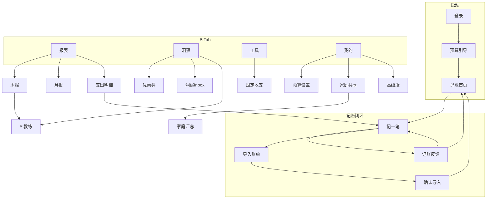

# 家计通 · 交互原型

基于已开发代码（`src/pages/` 共 27 个页面）生成的**可点击 HTML 原型**，用于产品评审、交互演示和开发对照。

## 打开方式

```bash
# 方式 1：直接用浏览器打开
open jiajiting/prototype/index.html

# 方式 2：本地静态服务（推荐）
cd jiajiting/prototype && python3 -m http.server 8080
# 访问 http://localhost:8080
```

## 功能说明

| 区域 | 说明 |
|------|------|
| **左侧导航** | 27 个页面一键跳转 |
| **中间手机框** | 高保真线框 + 品牌色，模拟小程序 375px 宽度 |
| **底部 Tab** | 5 Tab 切换（记账/报表/洞察/工具/我的） |
| **右侧日志** | 实时记录点击与跳转 |
| **Toast** | 模拟语音、订阅、计算、分享等反馈 |

## 页面清单（与代码一一对应）

```
pages/auth/login              → 登录
pages/auth/bind-phone         → 绑定手机
pages/onboarding/index        → 预算引导
pages/record/index            → 记账首页
pages/record/quick            → 记一笔
pages/record/feedback         → 记账反馈
pages/record/import           → 导入账单
pages/record/import-confirm   → 确认导入
pages/report/index            → 报表
pages/report/detail           → 支出明细
pages/report/weekly           → 周报
pages/report/monthly          → 月报
pages/savings/index           → 洞察 Tab
pages/coupons/index           → 优惠券
pages/tools/index             → 工具
pages/profile/index           → 我的
pages/profile/insights        → 洞察 Inbox
pages/profile/coach           → AI 教练
pages/profile/achievements    → 成就
pages/settings/*              → 各设置页
pages/family/summary          → 家庭汇总
```

## 推荐演示路径

1. **新用户**：登录 → 预算引导 → 记一笔 → 反馈页
2. **日常记账**：首页快捷分类 → 语音/键盘 → 确认
3. **报表分析**：报表 → 周报 → AI 解读 → 月报热力图
4. **省钱洞察**：洞察 Tab → 联盟优惠 → 优惠券中心
5. **工具**：房贷计算 → 同步固定支出
6. **设置**：我的 → 家庭共享 → 高级版

## 交互流程图



## 文件结构

```
prototype/
├── index.html    # 入口
├── styles.css    # 设计 Token + 手机框样式
├── app.js        # 27 页面定义 + 路由 + 交互
└── README.md     # 本说明
```
